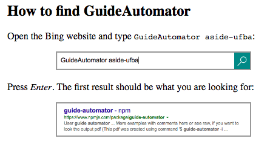
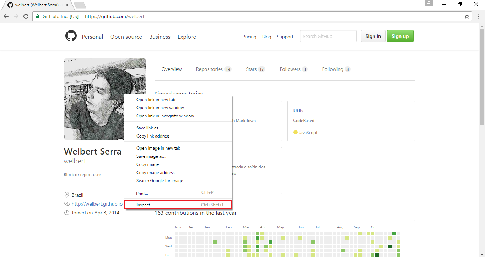
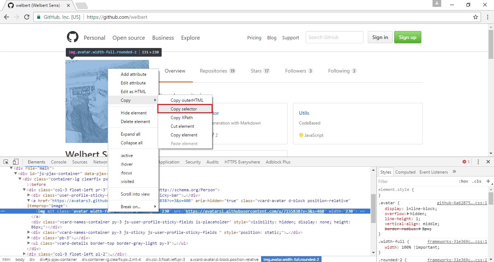
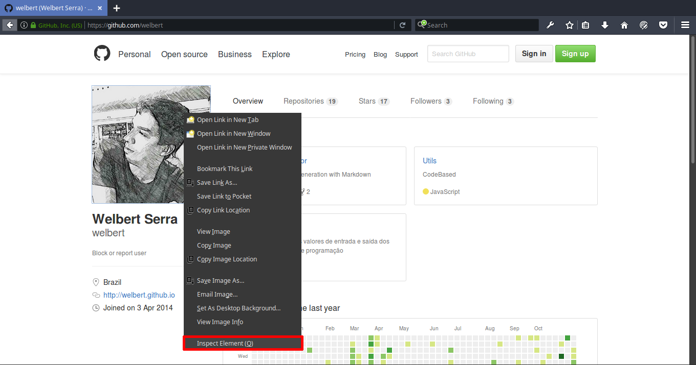
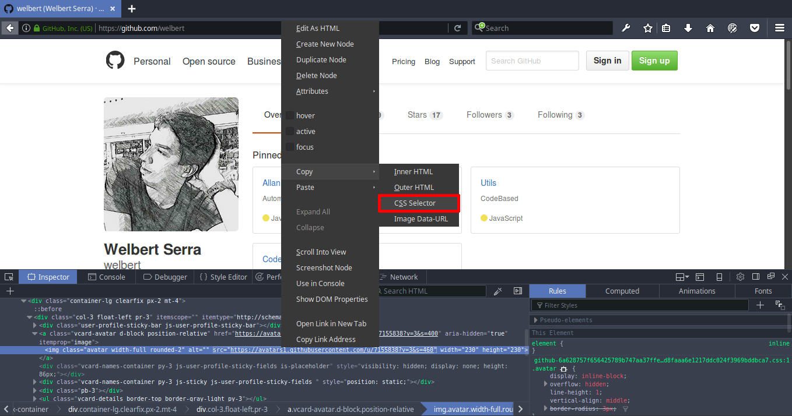

# GuideAutomator

[](https://badge.fury.io/js/guide-automator)
[](https://nodejs.org/en/download/)
[](https://david-dm.org/aside-ufba/guide-automator)

[](https://nodei.co/npm/guide-automator/)
> Automated User Guide Generation with Markdown

GuideAutomator allows developers and technical writers to create user manuals with screenshots that are always in sync with the latest version of the application being documented. For that end, it takes as input a Markdown file containing the user manual text with short JavaScript chunks that determine how to capture each screencast.

Sample GuideAutomator input:

    ## How to find GuideAutomator

    Open the Bing website and type `GuideAutomator aside-ufba`:

    ```javascript
    get('https://bing.com/');
    fillIn('#sb_form_q', 'GuideAutomator aside-ufba');
    takeScreenshotOf('#sb_form>div', true);
    ```

    Press *Enter*. The first result should be what you are looking for:

    ```javascript
    submit('#sb_form');
    takeScreenshotOf('#b_results>li:nth-child(1)', true);
    ```

Corresponding output:



GuideAutomator was proposed by professor [Rodrigo Souza](https://github.com/rodrigorgs) and originally implemented by [Allan Oliveira](https://github.com/rodrigorgs) as part of his [Bachelor's thesis](https://repositorio.ufba.br/ri/bitstream/ri/20947/1/monografia-allan-versao-final.pdf). The project is now being maintained by [Welbert Serra](https://github.com/welbert). The project is being developed in the context of [aSide](https://translate.google.com/translate?sl=pt&tl=en&js=y&prev=_t&hl=en&ie=UTF-8&u=http%3A%2F%2Fwiki.dcc.ufba.br%2FAside%2F&edit-text=&act=url), a research group at the [Federal University of Bahia](https://en.wikipedia.org/wiki/Federal_University_of_Bahia) specialized in software design and evolution.

Related publications:

- [GuideAutomator: Continuous Delivery of End User Documentation](https://rodrigorgs.github.io/files/icse-nier2017-rodrigo.pdf) -- paper accepted at [ICSE 2017, NIER Track](http://icse2017.gatech.edu/?q=nier) (New Ideas and Emerging Results)
- [GuideAutomator: Automated User Manual
Generation with Markdown](https://repositorio.ufba.br/ri/bitstream/ri/20947/1/monografia-allan-versao-final.pdf) -- Allan Oliveira's bachelor thesis
- [GuideAutomator: Automated User Manual Generation with Markdown](https://rodrigorgs.github.io/files/cbsoft2016-tools.pdf) -- paper presented at CBSoft 2016 (Tools Track)

---

## Summary

- [Installation](#installation)
  - [Prerequisites](#prerequisites)
  - [Linux](#linux)
  - [Windows](#windows)
- [Getting started](#getting-started)
  - [Description](#description)
  - [Example](#example)
  - [Css selector](#css-selector)
  - [Firefox extension](#firefox-extension)
- [Usage](#usage)
- [Api commands](#api-commands)
- [Using GD.driver](#using-gddriver)
- [Author](#author)
  - [Contributors](#contributors)

----
## Installation
----
#### Prerequisites
  - Nodejs && npm (Compiler)
  - ImageMagick (Needed for cropping images)
  - Wkhtmltopdf (Needed for converting html to pdf)
  - Chrome and Chrome WebDriver (Selenium Web Browser automation)

[back to top](#guideautomator)

#### Linux

  - (Option 1)You can install with script

    ```coffeescript
    sudo wget -qO- https://raw.githubusercontent.com/welbert/guide-automator/master/install_linux.sh | bash -
    ```

  - (Option 2) Manual installation. You need install some binary dependencies.

    1.[Node and npm:](https://nodejs.org/en/download/package-manager/#debian-and-ubuntu-based-linux-distributions)
    ```
      https://nodejs.org/en/download/package-manager/#debian-and-ubuntu-based-linux-distributions
    ```
    2.[ImageMagick](https://www.imagemagick.org/script/binary-releases.php#unix) (Usually is already installed):
    ```
      https://www.imagemagick.org/script/binary-releases.php#unix
    ```
    3.[Wkhtmltopdf](http://wkhtmltopdf.org/downloads.html)
    ```
      http://wkhtmltopdf.org/downloads.html
    ```
    4.[Chrome](https://www.google.com/chrome/browser/desktop/index.html)/Chromium Browser
    ```
    -Chrome:
      https://www.google.com/chrome/browser/desktop/index.html
    -Chromium:
      sudo apt-get install chromium-browser
    ```
    5.[Chrome WebDriver](https://chromedriver.storage.googleapis.com/index.html?path=2.25/)
    ```
      https://chromedriver.storage.googleapis.com/index.html?path=2.25/
    ```
    6.[Guide-Automator](https://www.npmjs.com/package/guide-automator)
    ```
      sudo npm install -g guide-automator
    ```
  *Node, wkhtmltopdf and Chrome WebDriver need to be add in path.*

[back to top](#guideautomator)

#### Windows

  1.[Node and npm:](https://nodejs.org/en/download/)
  ```
    https://nodejs.org/en/download/
  ```
  2.[ImageMagick:](https://www.imagemagick.org/script/binary-releases.php#windows) (Check to install legacy utilities)
  ```
    https://www.imagemagick.org/script/binary-releases.php#windows
  ```
  3.[Wkhtmltopdf](http://wkhtmltopdf.org/downloads.html)
  ```
    http://wkhtmltopdf.org/downloads.html
  ```
  4.[Chrome](https://www.google.com/chrome/browser/desktop/index.html)
  ```
  -Chrome:
    https://www.google.com/chrome/browser/desktop/index.html
  ```
  5.[Chrome WebDriver](https://chromedriver.storage.googleapis.com/index.html?path=2.25/)
  ```
    https://chromedriver.storage.googleapis.com/index.html?path=2.25/
  ```
  6.[Guide-Automator](https://www.npmjs.com/package/guide-automator)
  ```
    npm install -g guide-automator
  ```
  *Node, ImageMagick(convert.exe), Wkhtmltopdf and Chrome WebDriver need to be add in path.*

[back to top](#guideautomator)

---
## Getting started
---

#### Description
Guide-automator extract javascript tags (\`\`\`javascript guide-automator commands \`\`\`) from markdown file and generate manual from them. You need use our [API commands](#api-commands) in markdown file.

[back to top](#guideautomator)

#### Example:
```
# This is my github

```javascript
  get('https://github.com/welbert');
  takeScreenshot();
  takeScreenshotOf('.avatar',false,true);

```(<- three back-ticks)

```
More examples with comments [here](./examples/example.md) or see [raw](https://raw.githubusercontent.com/Allan1/guide-automator/master/examples/example.md), if you want to look the output [pdf](./output/manual.pdf) (_This pdf was created using command '$ guide-automator -i examples/example.md -o output/ -s lightBlue'_)

[back to top](#guideautomator)

#### Css selector
You will need know how to extract css selector of Web elements, you can use the browser to do that. If you dont know how to do this, see below.

* Google Chrome






* Mozilla Firefox






After this steps, the css selector will be copied to your clipboard

[back to top](#guideautomator)

---
#### Firefox extension
---
You can use the firefox addon to make easy the construction of blocks

[Guide-automator-addon](https://addons.mozilla.org/en-US/firefox/addon/guide-automator/)


[back to top](#guideautomator)

---
## USAGE
---

```
$ guide-automator -h

  Usage: guide-automator [options]

  Options:


    -h, --help             Output usage information
    -V, --version          Output the version number
    -i, --input <File.md>  Input .md file
    -o, --output <Folder>  Output destination folder
    -P, --pdf              Export manual to PDF, default is export for all types
    -H, --html             Export manual to HTML, default is export for all types
    -I, --image            Export ONLY manual's image and ignore others types, default is export for all types
    -s, --style <style.css>  Css style to be used in the manual or theme [lightBlue,lightOrange]
    -t, --autosleep <Millisecond>  Time to sleep before screenshot
    -d, --debug              Show progress of code

  Examples:

    $ guide-automator -i input.md -o output/
    $ guide-automator -i input.md
    $ guide-automator -i input.md -o output/ -s lightBlue

```

[back to top](#guideautomator)

---
## API commands
---

Params: `<Required>` `[Optional]`

- [get](#get)
- [click](#click)
- [clickByLinkText](#clickbylinktext)
- [takeScreenshot](#takescreenshot)
- [takeScreenshotOf](#takescreenshotof)
- [fillIn](#fillin)
- [submit](#submit)
- [wait](#wait)
- [sleep](#sleep)
- [console.print](#consoleprint)
- [pageContext](#pagecontext)

### get
- Description: Url to access
- Params: `<url>`
- Example:
  - get('https://github.com/welbert');

### click
- Description: Click on element
- Params: `<cssSelector>`
- Example:
  - click('.unstarred > button:nth-child(2)');

### clickByLinkText
- Description: Click on link text(\<a\>)
- Params: `<linkText>`
- Example:
  - clickByLinkText('README.md');

### takeScreenshot
- Description: Take Screenshot
- Params: `[imageWidth]`
- Example:
  - takeScreenshot();
  - takeScreenshot('10%');

### takeScreenshotOf
- Description: Take Screenshot of specific element
- Params: `<cssSelector>`, `[crop]`, `[outline]`, `[imageWidth]`
- Params: `Array(<cssSelector>,[cssSelector],...)`, `[crop]`, `[outline]`, `[imageWidth]`
- Params: `Array(Array(<cssSelector>,<Iframe-CssSelector>),[cssSelector],...)`, `[crop]`, `[outline]`, `[imageWidth]`
- Example:
  - takeScreenshotOf('#user-content-guideautomator');
  - takeScreenshotOf('#user-content-guideautomator',false,true);
  - takeScreenshotOf(['#user-content-guideautomator','.avatar'],false,true); //Multiple cssSelector(only for outline)
  - takeScreenshotOf([['#user-content-guideautomator','#frameID'],'.avatar'],false,true) //Multiple cssSelector (only for outline) on different contexts(Iframe)

### fillIn
- Description: Fill in field element
- Params: `<cssSelector>`, `<input>`
- Example:
  - fillIn('.header-search-input','guide-automator');

### submit
- Description: Submit a form
- Params: `<cssSelector>`
- Example:
  - submit('.js-site-search-form');

### wait
- Description: Wait element load on page
- Params: `<cssSelector>`, `[timeOut]`
- Example:
  - wait('.commit-author-section');
  - wait('.commit-author-section',2000);

### sleep
- Description: Sleep for a while
- Params: `<milleseconds>`
- Example:
  - sleep(1000);

### console.print
- Description: Print text on markdown file using javascript blocks
- Params: `<text>`
- Example:
  - console.print('# Title');

### pageContext
- Description: Need to change context to iframe or context default(Main page)
- Params: `[cssSelector]`
- Example:
  - pageContext('#Iframe-CssSelector');
  - pageContext('default'); //Equivalent to pageContext();
  - pageContext();

[back to top](#guideautomator)

---
## Using GD.driver
---
_This topic is for more complex cases or personal needs that guide-automator does not support_

Example:
```
GD.driver.actions().
  mouseMove({x:216, y:41}).
  click().
  perform();
```

See [raw](https://raw.githubusercontent.com/Allan1/guide-automator/master/examples/driver-example.md)

[Selenium Documentation](https://seleniumhq.github.io/selenium/docs/api/javascript/module/selenium-webdriver/chrome_exports_Driver.html)

[back to top](#guideautomator)
