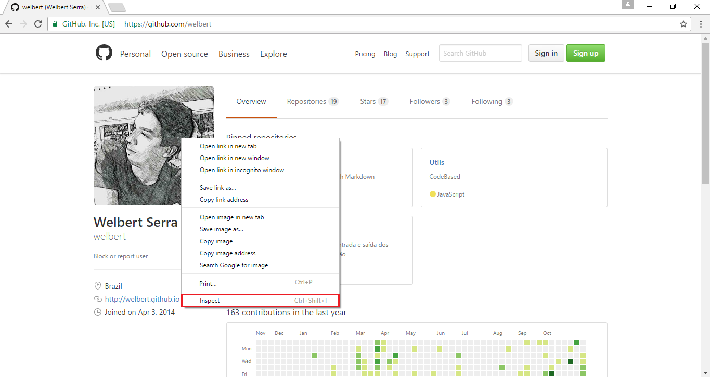
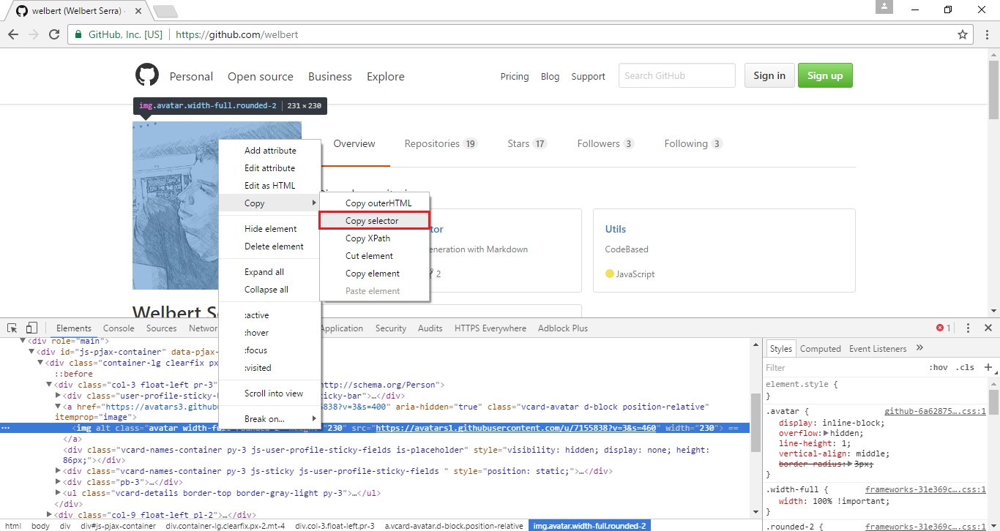
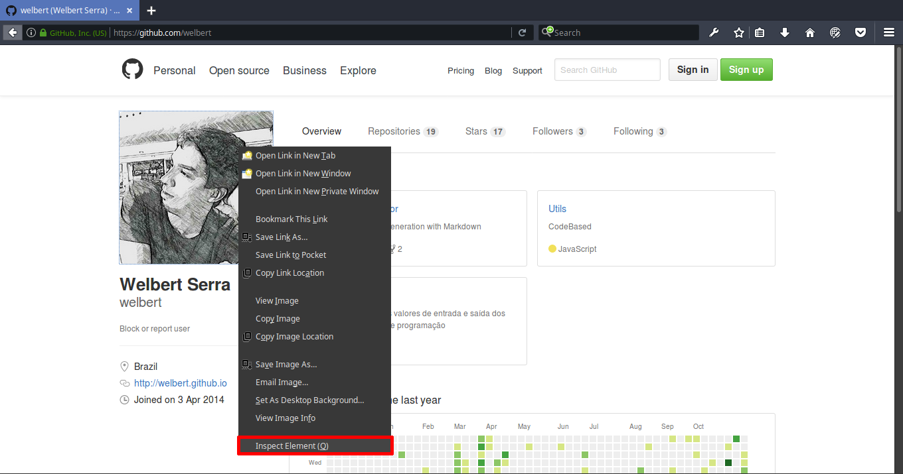
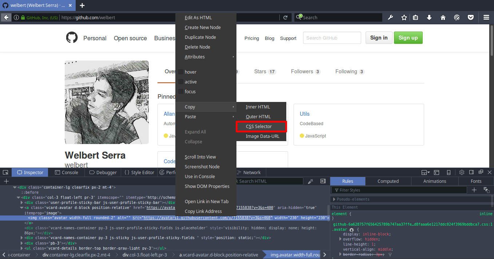

# GuideAutomator
[](https://badge.fury.io/js/guide-automator)
[](https://nodejs.org/en/download/)
[](https://david-dm.org/allan1/guide-automator)

[](https://nodei.co/npm/guide-automator/)
> Automated User Guide Generation with Markdown

- [Installation](#installation)
  - [Prerequisites](#prerequisites)
  - [Linux](#linux)
  - [Windows](#windows)
- [Getting started](#getting-started)
  - [Description](#description)
  - [Example](#example)
  - [Css selector](#css-selector)
- [Usage](#usage)
- [Api commands](#api-commands)

----
## Installation
----
#### Prerequisites
  - Nodejs && npm (Compiler)
  - ImageMagick (Need to crop the image)
  - Wkhtmltopdf (Need to convert html to pdf)
  - Chrome and Chrome WebDriver (Selenium Web Browser automation)

#### Linux

  - (Option 1)You can install with script

    ```coffeescript
    sudo wget -qO- https://raw.githubusercontent.com/welbert/guide-automator/master/install_linux.sh | bash -
    ```

  - (Option 2) Manual installation. You need install some binary dependencies.

    1.[Node and npm:](https://nodejs.org/en/download/package-manager/#debian-and-ubuntu-based-linux-distributions)
    ```
      https://nodejs.org/en/download/package-manager/#debian-and-ubuntu-based-linux-distributions
    ```
    2.[ImageMagick](https://www.imagemagick.org/script/binary-releases.php#unix) (Usually is already installed):
    ```
      https://www.imagemagick.org/script/binary-releases.php#unix
    ```
    3.[Wkhtmltopdf](http://wkhtmltopdf.org/downloads.html)
    ```
      http://wkhtmltopdf.org/downloads.html
    ```
    4.[Chrome](https://www.google.com/chrome/browser/desktop/index.html)/Chromium Browser
    ```
    -Chrome:
      https://www.google.com/chrome/browser/desktop/index.html
    -Chromium:
      sudo apt-get install chromium-browser
    ```
    5.[Chrome WebDriver](https://chromedriver.storage.googleapis.com/index.html?path=2.25/)
    ```
      https://chromedriver.storage.googleapis.com/index.html?path=2.25/
    ```
    6.[Guide-Automator](https://www.npmjs.com/package/guide-automator)
    ```
      sudo npm install -g guide-automator
    ```
  *Node, wkhtmltopdf and Chrome WebDriver need to be add in path.*


#### Windows

  1.[Node and npm:](https://nodejs.org/en/download/)
  ```
    https://nodejs.org/en/download/
  ```
  2.[ImageMagick:](https://www.imagemagick.org/script/binary-releases.php#windows)
  ```
    https://www.imagemagick.org/script/binary-releases.php#windows
  ```
  3.[Wkhtmltopdf](http://wkhtmltopdf.org/downloads.html)
  ```
    http://wkhtmltopdf.org/downloads.html
  ```
  4.[Chrome](https://www.google.com/chrome/browser/desktop/index.html)
  ```
  -Chrome:
    https://www.google.com/chrome/browser/desktop/index.html
  ```
  5.[Chrome WebDriver](https://chromedriver.storage.googleapis.com/index.html?path=2.25/)
  ```
    https://chromedriver.storage.googleapis.com/index.html?path=2.25/
  ```
  6.[Guide-Automator](https://www.npmjs.com/package/guide-automator)
  ```
    npm install -g guide-automator
  ```
  *Node, ImageMagick,wkhtmltopdf and Chrome WebDriver need to be add in path.*


---
## Getting started
---

#### Description
Guide-automator extract javascript tags (\```javascript guide-automator commands ```) from markdown file and generate manual from them. You need use our [API commands](#api-commands) in markdown file.

#### Example:
```
# This is my github

```javascript
  get('https://github.com/welbert');
  takeScreenshot();
  takeScreenshotOf('.avatar',false,true);
```(<- three back-ticks)

```
More examples with comments [here](./examples/example.md) or see [raw](https://raw.githubusercontent.com/Allan1/guide-automator/master/examples/example.md), if you want to look the output [pdf](./output/manual.pdf)

#### Css selector
You will need know how to extract css selector of Web elements, you can use browser to do that if you dont know how to do this, see below.

* Google Chrome






* Mozilla Firefox






After this steps, the css selector will be copied to your clipboard

---
## USAGE
---

```
$ guide-automator -h

  Usage: guide-automator [options]

  Options:


    -h, --help             output usage information
    -V, --version          output the version number
    -i, --input <File.md>  Input .md file
    -o, --output <Folder>  Output destination folder
    -P, --pdf              Export manual to PDF, default is export for all types
    -H, --html             Export manual to HTML, default is export for all types
    -I, --image            Export ONLY manual's image and ignore others types, default is export for all types
    -s, --style <style.css>  Css style to be used in the manual or theme [lightBlue,lightOrange]
    -L, --legacy           Use Legacy mode "<automator>" [DEPRECATED]
    -d, --debug              Show progress of code

  Examples:

    $ guide-automator -i input.md -o output/
    $ guide-automator -i input.md
    $ guide-automator -i input.md -o output/ -s lightBlue

```

---
## API commands
---

Params: `<Required>` `[Optional]`

- [get](#get)
- [click](#click)
- [clickByLinkText](#clickbylinktext)
- [takeScreenshot](#takescreenshot)
- [takeScreenshotOf](#takescreenshotof)
- [fillIn](#fillin)
- [submit](#submit)
- [wait](#wait)
- [sleep](#sleep)


## get
- Description: Url to access
- Params: `<url>`
- Example:
  - get('https://github.com/welbert');

## click
- Description: Click on element
- Params: `<cssSelector>`
- Example:
  - click('.unstarred > button:nth-child(2)');

## clickByLinkText
- Description: Click on link(<a>) text
- Params: `<linkText>`
- Example:
  - clickByLinkText('README.md');

## takeScreenshot
- Description: Take Screenshot
- Params: `[imageWidth]`
- Example:
  - takeScreenshot();
  - takeScreenshot('10%');

## takeScreenshotOf
- Description: Take Screenshot of specific element
- Params: `<cssSelector>`, `[crop]`, `[outline]`, `[imageWidth]`
- Example:
  - takeScreenshotOf('#user-content-guideautomator');
  - takeScreenshotOf('#user-content-guideautomator',false,true);

## fillIn
- Description: Fill in field element
- Params: `<cssSelector>`, `<input>`
- Example:
  - fillIn('.header-search-input','guide-automator');

## submit
- Description: Submit a form
- Params: `<cssSelector>`
- Example:
  - submit('.js-site-search-form');

## wait
- Description: Wait element load on page
- Params: `<cssSelector>`, `[timeOut]`
- Example:
  - wait('.commit-author-section');
  - wait('.commit-author-section',2000);

## sleep
- Description: Sleep for a while
- Params: `<milleseconds>`
- Example:
  - sleep(1000);
